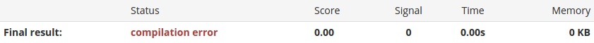
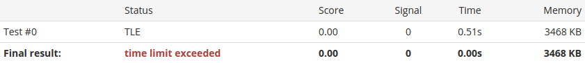
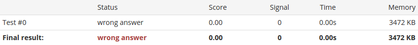
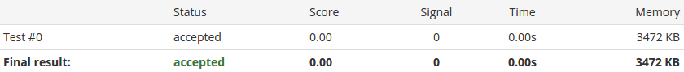

Appendix
========

.. _appendix-good-test-cases-design:

Good test cases design
----------------------

It is common misunderstanding which leads to bad test cases design. The number of test cases assigned to the problem is limited. The individual test case is not intended to test only one problem instance.

.. tip::
  We recommend you to redesign your input / output specification to handle with multiple problem instances in one test case. 

Consider the following elementary problem as an example:

.. admonition:: Task example
  :class: note

  For given integer numbers *a* and *b* calculate the sum *a + b*.

We could design the input / output specification to calculate the sum only for two numbers:

.. admonition:: Poor input / output design example
  :class: note

  **Input**
    In the only line of the input there will be two integer numbers *a* and *b* separated by a single space character.

  **Output**
    Program should write a single number which is the value of *a* + *b*.
            
It is correct but it is highly not recommended. First of all using even all possible slots for test cases cover a small part of the possible problem instances. Secondly, the execution of each test case is time consuming (about *2s* additional time for each test case).
           
We recommend to redesign the input / output specification in following manner:

.. admonition:: Proper input / output design example
  :class: note

  **Input**
    In the first line there will be the number *t* which is the number of instances for the problem. In each of the next *t* lines there will be the pair of two numbers *a* and *b* for which you should calculate the value of *a* + *b*.

  **Output**
    For each *a,b* pair print the calculated sum. Separate answers with new line character.
       
As you can see it is possible to pack a large number of problem instance into single test case.

.. note::
  Multiple test cases should rather be used to test different aspect of the problem.

.. _appendix-interactive-problems:

Interactive problems
--------------------

The standard schema of the submission processing assumes that at first the execution of the user's program generates the user's output and after that the test case judge in a certain way compares it with the model output. In the *interactive problem* these phases are executed simultaneously. 

The execution of the user's program starts and its standard output is directed to the test case judge as its standard input. In the same time the test case judge program starts and its standard output is directed to the user's program as its standard input. This allows a *conversation* between the user's program and the test case judge as you can see in the picture below.

.. _interactive-problem-digram:

.. image:: ../_static/interactive-diagram.png
   :alt: Interactive problem communication diagram
   :width: 350px
   :align: center

|

.. important::
	Interactive problem requires dedicated test case judge.

When the conversation is open, the test case judge can interactively generate input for the user's program depending on its output and in the same time it is possible to verify the correctness of the results.

.. admonition:: Interactive problem example
  :class: note

  Write a program that will win the chess game with the opponent who make random legal moves.

  **Input**
  	The first line of the input contains the number *s* which can be *0* or *1*. If *s* = *0*, then your opponent plays white pieces and if *s* = *1* then you plays white pieces. In the next lines there will be moves of your opponent write in the standard chess algebraic notation (for example *e4 e5* means that the piece on *e4* moves to *e5*). You can assume that all opponent moves are legal. When the match is over the final line of the input will be "win" or "lose" and the program will be accepted only if the user's solution win the match.

  **Output**
  	If *s* = *1* you start with the first move (i.e. you write the line with your move in the standard chess algebraic notation) and after that you write your next move after you get your opponent's move and so on and so forth. 
  	If *s* = *0* you wait for your opponent's move and then again you play move by move.

By the description of the interactive problem example you can see that we need to implement the test case judge which is able to play random chess game:
 
	- it remembers the state of the chess board,
	- it can make legal moves
	- it can verify that the game is over and who is the winner
	- it accepts only solutions which won the game

.. attention::
	Due to common issues with the standard output writes we highly recommend you to clear the output buffer after printing each line. It can be done by using the *fflush(stdout)* command in the C/C++ languages.

.. _appendix-testing-time-complexity:

Time complexity
-----------------------------------------

Test cases along with time limits give a possibility of verification time complexity of algorithms. Consider the most basic case when the author knows **two** different algorithms for a problem, say *A* and *B* and let us assume that the algorithm *A* is noticeably faster than the algorithm *B*.

.. note::
  It is not always easy and obvious how to preper test cases to distinguish between two algorithms.

Assuming that we have input data which is processed in the time *t*\ :sub:`A`\ for the algorithm *A* 
which is much faster than execution time *t*\ :sub:`B`\ for the algorithm *B* we can simply set the 
time limit somewhere between those values.

.. important::        
  The presented approach highly depends on the machine thus you need to adjust your time limit to the computing cluster rather then your local machine.

With the timeout *t*\ :sub:`A`\ |le| *t*\ :sub:`0`\ |le| *t*\ :sub:`B`\ we can assume that *A*-like algorithms 
will pass the test case and *B*-like algorithms will fail it due to exceeding the time limit.

.. caution::
  Presented method **is not** a real time complexity testing, slower algorithm can beat the faster one when it is well technically optimized for the test cases and the machine. 

  It **is also not** a universal method - changing the machine can allow slower algorithms to pass test cases designed for faster algorithms only.

The sorting problem is one of the most demonstrative example when there are many different solutions. All natural solutions need approximetly *n*\ :sup:`2` \ operations to sort the sequence of length *n*. However, the more sophisticated algorithms guarantee approximately *n*\ log(\ *n*\ ) operations which is significantly better result.

In the :ref:`problem example <full-problem-example>` section you can see properly prepared test cases which distinguish solutions for *The initial sum*\ [#]_ \ problem.

.. note::
  Obviously for problems with many (not only *2*) solutions of different speeds you can construct a hierarchy of test cases to reflect the gradation of solutions in scores.

.. _appendix-testing-memory-complexity:

Memory complexity
-------------------------------------------

Similarly to time complexity testing one can test memory complexity of algorithms. Consider the simplest situation when the author knows **two** different algorithms for a problem, say *A* and *B*. Let us assume that algorithm *A* consumes small and constant amount of memory and algorithm *B* memory needs are dependent on the problem input data (possibly big amounts).

You can distinguish between solutions *A* and *B* by constructing adjusted test cases. If we denote that designed test case makes algorithm *A* to use *m*\ :sub:`A` \ megabytes of memory and algorithm *B* to use *m*\ :sub:`B` \ megabytes of memory and these values are separated you can set the memory limit *m*\ :sub:`0` \ megabytes somewhere between *m*\ :sub:`A` \ and *m*\ :sub:`B`\ .

.. important::
  We **do not** directly support memory limit option due to complications with solutions written in virtual machine interpreted languages (for example Java languages family).

Due to the note above you need to approach individually to limit the memory that program can use. As we said there is no single parameter which sets memory limit. To obtain desired functionality you can construct custom *master judge* and limit the memory inside separetely for each programming language you allow to use for solutions.

.. admonition:: Example
  :class: note 

  *The prime number*\ [#]_ \ problem can be solved in constant memory by looking for divisors or alternatively with Sieve of Eratosthenes algorithm which consumes the amount of memory which depends on the input number.

  

.. _appendix-statuses:

Statuses
--------

There are two levels when the status is assigned to the submission:

 * **test case** the status is produced by the test case judge,
 * **master judge** the status is a combination of statuses from test cases.

The master judge is a high order level component and it can arbitrary assign any status to the submission. We are going to focus on the test case judge statuses.

We separate statuses into two groups: semantic and systemic. The semantic statuses are strictly related to the correctness of the answer to the problem. On the other hand, the systemic statuses are syntactic related and the judge gets it from the system.

**Semantic statuses**
  * **Accepted (AC)** the submission is a correct solution to the problem.
  * **Wrong answer (WA)** the submission is an incorrect solution.     

**Sytemic statuses**
  * **Time limit exceeded (TLE)** the submission execution took too long.
  * **Runtime error (RE)** the error occurred during program execution.

    * **NZEC** (Non-Zero Exit Code) main function returned error signal (for example main function in C/C++ should return 0).
    * **SIGSEGV** the program accessed unallocated memory (segmentation fault).
    * **SIGABRT** the program received abort signal, usually programmer controls it (for example when C/C++ assert function yields false).
    * **SIGFPE** the floating point error, usually occurs when dividing by 0.
  * **Compilation error (CE)** the error occurred during compilation or syntax validation in interpreter.
  * **Internal error (IE)** the error occurred on the serivice side. One of the possible reasons can be poorly designed test case judge or master judge.

.. note::
  The Internal error covers wide area of errors (including server errors) thus in the near future we will introduce another type of error for judge and master judge errors.

To ilustrate errors consider again the following example:

.. admonition:: Example
  :class: note

  For a positive integer *n* calculate the value of the sum of all positive integers that are not greater than *n* i.e. *1* + *2* + *3* + ... + *n*. For example when *n* = *5* then the correct answer is *15*.

  **Input**
    In the first line there will be the number *1* |le| *t* |le| *10000000* which is the number of instances for your problem. In each of the next *t* lines there will be one number *n* for which you should calculate the described initial sum.

  **Output**
    For each *n* print the calculated initial sum. Separate answers with new line character.

The first error which can occur is the *compilation error*, for example submitting the following source code would produce the *CE* status:

.. code-block:: cpp
   
   long long initsum(long long n)
   {
     return n*(n+1)/2;
   }
   
   int main()
   {
     int t // missing semicolon
     long long n;
     scanf("%d", &t);
     while (t > 0)
     {
       scanf("%lld", &n);
       printf("%lld\n", initsum(n));
       t--;
     }
     return 0;
   }

|

To obtain *runtime error* we can refer to unallocated memory:

.. code-block:: cpp
   
   long long initsum(long long n)
   {
     return n*(n+1)/2;
   }
   
   int main()
   {
     int t;
     long long n;
     scanf("%d", &t);
     while (t > 0)
     {
       scanf("%lld", n); // referring to unallocated memory 
       printf("%lld\n", initsum(n));
       t--;
     }
     return 0;
   }

|

We will *exceed time limit* with worse algorithm (if test cases are rich enough):

.. code-block:: cpp
   
   // suboptimal algorithm
   long long initsum(long long n)
   {
     int i;
     long long sum = 0;
     for (i=1; i <= n; i++)
     {
       sum += i;
     }
     return sum;
   }
   
   int main()
   {
     int t;
     long long n;
     scanf("%d", &t);
     while (t > 0)
     {
       scanf("%lld", &n);
       printf("%lld\n", initsum(n));
       t--;
     }
     return 0;
   }

|

Bad output formatting causes *wrong answer* status:

.. code-block:: cpp

   long long initsum(long long n)
   {
     return n*(n+1)/2;
   }
   
   int main()
   {
     int t;
     long long n;
     scanf("%d", &t);
     while (t > 0)
     {
       scanf("%lld", &n);
       printf("%lld", initsum(n)); // missing new line character
       t--;
     }
     return 0;
   }

|

At the end we present correct and optimal solution which passes all test cases and obtains *accepted* status:

.. code-block:: cpp
   
   long long initsum(long long n)
   {
     return n*(n+1)/2;
   }
   
   int main()
   {
     int t;
     long long n;
     scanf("%d", &t);
     while (t > 0)
     {
       scanf("%lld", &n);
       printf("%lld\n", initsum(n));
       t--;
     }
     return 0;
   }

|

.. _appendix-submission-information:

Submission information
----------------------

TODO: How the information from judges flows.

|

.. rubric:: Footnotes

.. [#] The initial sum problem is to calculate the value of *1* + *2* + *3* + ... + *n* for given integer *n*.
.. [#] The prime number problem is to verify if *n* is a prime number.